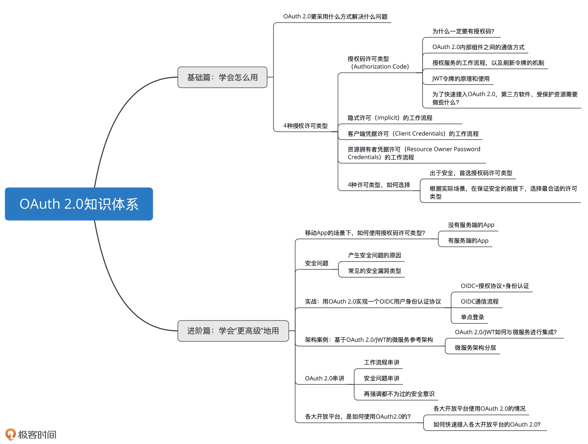

# OAuth2.0

 OAuth 1.0 想用一套授权机制来应对现实中的所有场景，比如 Web 应用场景、移动 App 应用场景、官方应用场景等等，但是这些场景并 不是完全相同的。比如官方应用场景，你说还需要让用户来授权吗？如果需要，始终使用一 套授权机制给用户带来的体验，是好还是坏呢？

OAuth 2.0 不再局限 于一种授权机制，它扩充了授权许可机制类型，有了**授权码许可机制、客户端凭据机制、资 源拥有者凭据机制和隐式许可机制**。

OAuth 2.0 这种授权协议，就是保证第三方（软件）只有在获得授权之后， 才可以进一步访问授权者的数据。





搭建开放平台主要包括网关和授权两个系统，网关下面是一堆服务，调用量最大的是网关系统


#### OAuth 2.0 的4 种角色

资源拥有者、客户端、授权服务和受保护资源。不过，这里的客户端， 我更愿意称其为第三方软件。

资源拥有者 -> 小明，第三方软件 - > 小兔软件，授权服务 -> 京东商家开放平台的授权服务，受保护资源 -> 小明店铺在京东 上面的订单。


#### 授权码许可类型


### 授权服务的流程


第三方软件注册：开放平台就会给软件 app_id 和 app_secret 等信息

#### 过程一：颁发授权码 code

准备工作：验证基本信息、验证权限范围（第一次）和生成授 权请求页面

生成授权码 code

第一步，验证基本信息。

第二步，验证权限范围（第一次）。

第三步，生成授权请求页面。

第四步，验证权限范围（第二次）

第五步，处理授权请求，生成授权码 code

第六步，重定向至第三方软件

#### 过程二：颁发访问令牌 access_token

第一步，验证第三方软件是否存在 (app_id和app_secret）

第二步，验证授权码 code 值是否合法

确认过授权码 code 值有效以后，应该立刻从存储中删除当前的 code 值，以防止第三方软件恶意使用一个失窃的授权码 code 值来请求授权服务

第三步，生成访问令牌 access_token 值。


#### 刷新令牌

##### 颁发刷新令牌

颁发刷新令牌和颁发访问令牌是一起实现的

##### 使用刷新令牌

第一步，接收刷新令牌请求，验证基本信息

验证第三方软件是否存在，同时验证刷新令牌是否存在

第二步，重新生成访问令牌。


**Tip:** 授权服务需要将生成的授权码 code 值与 app_id、user 进行关系映射


### JWT结构化令牌

授权服务的核心就是颁发访问令牌

OAuth 2.0 规范并没有约束访问令牌内容的生成规则，只要符合唯一性、不连续性、不可猜性就够了。

结构化令牌  具有内部结构且包含有信息含义的字符串

**令牌内检**: 受保护资源来调用授权服务提供的检验令牌的服务


### 如何 接入OAuth 2.0

#### 构建第三方软件应用

开发第三方软件应用的过 程: 注册信息、引导授权、使用访问令 牌、使用刷新令牌

令牌 类型: bearer 令牌

令牌请求的方式:

#### 构建受保护资源服务

在构建受保护资源服务的时候，除了基本的要检查令牌的合法性，还需要 权限范围


所有的请求都会经过 API GATEWAY 跳转到不同的受保护资源服务。 我们就不需要在每一个受保护资源服务上都做一遍权限校验的工作了，而只需要 在 API GATEWAY 这一层做权限校验就可以了


### 许可类型:

授权码许可（Authorization Code）类型的流程 :

1.  OAuth 2.0 内部组件之间的通信方式，

2.  授权服务、客户端（第三方软件）、受保护资源服务

客户端凭据许可 （Client Credentials）

资源拥有者凭据许可 （Resource Owner Password Credentials）

隐式许可（Implicit）

#### 资源拥有者凭据许可

资源拥有者的凭据，就是用户的凭据，就是用户名和密码

场景第三方是官方出品的一款软件


#### 客户端凭据许可

如果没有明确的资源拥有者，换句话说就是，小兔软件访问了一个不需要用户小明授权的 数据，比如获取京东 LOGO 的图片地址，这个 LOGO 信息不属于任何一个第三方用户， 再比如其它类型的第三方软件来访问平台提供的省份信息，省份信息也不属于任何一个第 三方用户

可以 理解 为 “资源拥有者被塞进了第三方软件中” 或者 “第三方软件就是资源拥有者”。这种场 景下的授权，便是客户端凭据许可，第三方软件可以直接使用注册时的 app_id 和 app_secret 来换回访问令牌 token 的值


#### 隐式许可

如果小明使用的小兔打单软件应用没有后端服务，就是在浏览器里面 执行的，比如纯粹的 JavaScript 应用，应该如何使用 OAuth 2.0 呢？ 其实，这种情况下的授权流程就可以使用隐式许可流程

在这种情况下，小兔软件对于浏览器就没有任何保密的数据可以隐藏了，也不再需要应用 密钥 app_secret 的值了，也不用再通过授权码 code 来换取访问令牌 access_token 的值 了。因为使用授权码的目的之一，就是把浏览器和第三方软件的信息做一个隔离，确保浏 览器看不到第三方软件最重要的访问令牌 access_token 的值

#### 如何选择？

4 种授权许可类型最显著的区别: 就是**获取访问令牌 access_token 的方式不同**

如果小兔软件是官方出品，那么可以直接使用资源拥有者凭据许可；

如果小兔软件就是只嵌入到浏览器端的应用且没有服务端，那就只能选择隐式许可； 

如果小兔软件获取的信息不属于任何一个第三方用户，那可以直接使用客户端凭据许可类型。


### 移动App使用OAuth 2.0

.png)

#### 没有 Server 端的 App

既不使用 app_secret，还要防止授权码 code 失窃，有什么好的方法吗

 PKCE 协议，全 称是 Proof Key for Code Exchange by OAuth Public Clients

#### 有 Server 端的 App

以微信登录为例的流程图

.png)


### OAuth 2.0安全漏洞


###  OIDC（OpenID Connect）

**联合登录和单点登录：**使用微信、微博账号登录第三方 App；如果你的应用下面又有多个子应用，让用户只登录一次就能访问所有的 子应用

OIDC= 授权协议 + 身份认证，是 OAuth 2.0 的超集

OIDC是一种用户身份认证的开放标准，用微信登录某第三方软件，确实使用的是 OAuth 2.0。但 OAuth2.0 是一种授权协议，而不是身份认证协议。

OIDC 才是身份认证协议，而且是基于 OAuth 2.0 来执行用户 身份认证的互通协议。更概括地说，OIDC 就是直接基于 OAuth 2.0 构建的身份认证框架 协议

#### OIDC 的三个主要角色

EU（End User），代表最终用户。

RP（Relying Party），代表认证服务的依赖方，就是上面我提到的第三方软件。

OP（OpenID Provider），代表提供身份认证服务方

```
微信登录就是一个大的身份认证服务（OP）。一旦我们有了微信账号，就可以登录所有接入了微信登录体系的 App（RP）
```


OAuth 2.0 的 4 个角色和 OIDC 的 3 个角 色之间的对应关系


#### 基于授权码流程的 OIDC 协议流程


JWT为 OIDC 的 ID 令牌时，下面这 5 个声明参数也是必须要有的。

  iss，令牌的颁发者，其值就是身份认证服务（OP）的 URL。

 sub，令牌的主题，其值是一个能够代表最终用户（EU）的全局唯一标识符。

 aud，令牌的目标受众，其值是三方软件（RP）的 app_id。

 exp，令牌的到期时间戳，所有的 ID 令牌都会有一个过期时间。

 iat，颁发令牌的时间戳。

用访问令牌获取 ID 令牌之外的信息

OIDC 的流程就是：生成 ID 令牌 -> 创建 UserInfo 端点 -> 解析 ID 令牌 -> 记录登录状态 -> 获取 UserInfo

#### 单点登录

 

在 GitHub 上搜索“通过 OIDC 来实现单点登录”

## FQA

1.  授权码许可为什么需要交互两次  授权码 访问令牌? 

直接获取token的场景是有的，客户端凭据许可类型就是这样的使用场景，但是我们会在课程里面讲到，授权码许可类型是OAuth 2.0 最安全 最完备的许可类型


2. 授权码被盗取后能获取access_token吗？

一方面授权码也都有有效期，另外一方面除非再盗取了第三方应用软件的app_id、secret才能成功请求资源。


3. sessionid和access_token是两个完全不同的事物，sessionid是会话，access_token不能等同于会话，它是第三方软件代表用户访问数据的凭证

4. 内网两个服务器需要鉴权通信，就可以使用隐式授权？

    内部服务之间的鉴权的时候，【一般】的做法是这样，比如服务A调用服务B，B 要对 A 鉴权，当A申请去调用B的时候，B会”留下“A的app_id，同时会告知一个token，某种【层度】上跟隐式许可类似，这里没有了秘钥，但隐式许可是需要【用户】这个角色参与的，所以严格上来说不是OAuth 2.0 里面的隐式许可授权类型。倒是有点像失去了秘钥的客户端凭据许可。

    隐式许可的特点是第三方软件无法对浏览器隐藏任何秘密，因为第三方软件的任何信息都暴露在了浏览器里面，第三方软件也就没有办法，也无必要再持有秘钥，失去了一层保护，授权服务会直接返回access_token给到“嵌入”浏览器中的第三方软件，但是用户授权的动作还是要有的，用户不授权，授权服务不颁发access_token，当然这个access_token也暴露在了浏览器下面，所以隐式许安全性低了很多，另外也有它的使用局限性，仅仅在浏览器短暂运行的第三方软件的场景。

    

HTTPS 和 OAuth 是两个维度的安全，HTTPS解决的信息加密传输，OAuth 解决的是用token来代替用户名和密码传输

#### 


## 相关资料

https://www.baeldung.com/java-ee-oauth2-implementation

使用Spring Security实现OAuth2三角色+三模式完整例子 : https://juejin.cn/post/6844903703695245326

##### 开放平台

https://open.taobao.com/

https://open.jd.com/#/index